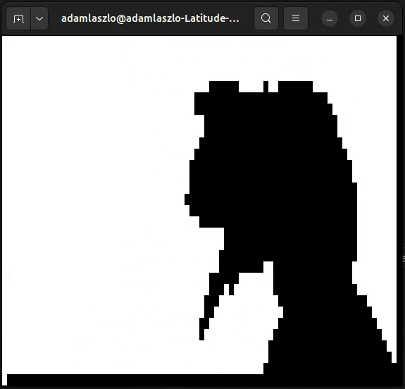

# terminal-video-player
A simple project to play videos in terminal.

## Features
- Play a video in terminal

## Screencasts


## Usage
### Install dependencies
```
python3 -m venv .venv
source .venv/bin/activate
pip install -r requirements.txt
```

### Play video
```
python3 main.py example/bad_apple.mp4
```